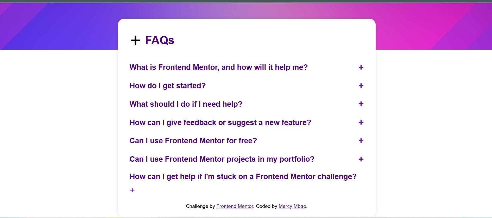

# Frontend Mentor - FAQ accordion solution

This is a solution to the [FAQ accordion challenge on Frontend Mentor](https://www.frontendmentor.io/challenges/faq-accordion-wyfFdeBwBz). Frontend Mentor challenges help you improve your coding skills by building realistic projects. 

## Table of contents

- [Overview](#overview)
  - [The challenge](#the-challenge)
  - [Screenshot](#screenshot)
  - [Links](#links)
- [My process](#my-process)
  - [Built with](#built-with)
  - [What I learned](#what-i-learned)
  - [Continued development](#continued-development)
  - [Useful resources](#useful-resources)
- [Author](#author)
- [Acknowledgments](#acknowledgments)

## Overview

### The challenge

Users should be able to:

- Hide/Show the answer to a question when the question is clicked
- Navigate the questions and hide/show answers using keyboard navigation alone
- View the optimal layout for the interface depending on their device's screen size
- See hover and focus states for all interactive elements on the page

### Screenshot




### Links

- Solution URL: [https://faq-frontend-mentor-challenge-bice.vercel.app/]
- Live Site URL: [https://faq-frontend-mentor-challenge-bice.vercel.app/]

## My process

### Built with

- Semantic HTML5 markup
- CSS custom properties
- Flexbox
- CSS Grid
- Mobile-first workflow
- [Javascript]
- [Canva] for design.

**Note: These are just examples. Delete this note and replace the list above with your own choices**

### What I learned

Use this section to recap over some of your major learnings while working through this project. Writing these out and providing code samples of areas you want to highlight is a great way to reinforce your own knowledge.

To see how you can add code snippets, see below:

```html
adding + as an icon to enable paragraph visibility when clicked.
<div class="accordion">
    <h3>
       What is Frontend Mentor, and how will it help me?
       <span class="icon">+</span>
    </h3>
    <p>
      Frontend Mentor offers realistic coding challenges to help developers improve their 
      frontend coding skills with projects in HTML, CSS, and JavaScript. It's suitable for 
      all levels and ideal for portfolio building.
    </p>
  </div>
```
```css
hiding this paragraph inorder to be displayed when the + icon is clicked.
.accordion p {
    display: none;
    font-size: 1rem;
    color: #333;
    margin-bottom: 10px;
    font-weight: bold;
}
```
```js
setting condtiton of what + icon should behave when clicked.
 if (paragraph.style.display === 'block') {
            paragraph.style.display = 'none';
            icon.textContent = '+'; // Collapse icon
        } else {
            paragraph.style.display = 'block';
            icon.textContent = '-'; // Expand icon
        }
```


### Continued development
Am still working on javascript development for the FAQ, such that when the + is clicked it shows the visible questions. also working to include more visually appealing that could be used.


### Useful resources

- [Example resource 1](https://ww3schools.com) - This helped me refrence how to work on accordion. .


## Author

- Website - [Add your name here](https://www.your-site.com)
- Frontend Mentor - [@yourusername](https://www.frontendmentor.io/profile/yourusername)
- Twitter - [@yourusername](https://www.twitter.com/junearsenic7)

## Acknowledgments

Am thankful for the dicord frontend community that provided necessary resources, the x community for sharing design ideas i could use. Lastly my friends who guided me.
